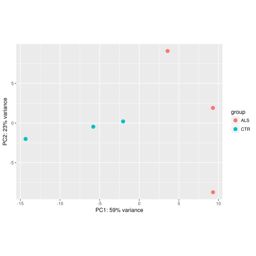

========================================================


# Introduction

The DESeq2 package provides functions to test for differential expression using count data. This vignette is based on the summarized data from the transcriptomic experiment (RNA-seq) that uses Human iPSCs and iMN cells. This vignette loads one study of 6 ALS samples and 6 controls samples from level 3 (3 biological replicates per group, two growth replicates for each biological replicate), performs statistical tests and generates level 4 data,i.e.differentially expressed gene list.

For details of how DESeq2 works and its parameter setting, please refer to 

DESeq2 manual: https://bioconductor.org/packages/release/bioc/manuals/DESeq2/man/DESeq2.pdf

DESeq2 vignette: https://www.bioconductor.org/packages/3.3/bioc/vignettes/DESeq2/inst/doc/DESeq2.pdf


# 1. Load the read count data

We first load the count file with *read.delim*. For input, the DESeq2 package expects count data as obtained in the form of a matrix of **integer** values. The value in the i-th row and the j-th column of the matrix represents how many reads have been mapped to gene i in sample j. These count values must be **raw** counts of sequencing reads.


```r
countsTable <- read.csv("https://hpc.oit.uci.edu/~jiew5/dcic.csv", header=T, stringsAsFactors=FALSE,check.names=F)
```

We specify that the first line of our file is the header and disable treating the strings in the file as factors.


```r
head(countsTable)
```

```
##        gene 29iALS-n1 29iALS-n2 28iALS-n1 28iALS-n2 30iALS-n1 30iALS-n2
## 1     MTVR2         0         1         0         0         1         0
## 2    CHMP1B      1713      1870      1781      1859      1715      1762
## 3 LOC441204        41        41        39        82        80        76
## 4     TCOF1      5733      6559      6446      6405      5478      6940
## 5     NSRP1       975      1223      1096      1136      1101      1186
## 6     SPPL3      1510      1617      1612      1354      1569      1399
##   00iCTR_n1 00iCTR_n2 25iCTR_n1 25iCTR_n2 83iCTR_n1 83iCTR_n2
## 1         2         0         1         0         1         0
## 2      1808      1758      1785      1503      1603      1470
## 3        70        48        53        32        41        38
## 4      5861      5518      6986      5810      6512      5690
## 5      1073      1086      1127       954      1097       980
## 6      1715      1775      1845      2056      1897      1780
```

The first column of the file is the gene names so we use them as the row names.

```r
rownames(countsTable) <- countsTable$gene
```

After setting the row names we remove the first column from the table so that the *countsTable* is the count matrix now. 


```r
countsTable <- countsTable[,-1]
```

Use *head* to examine the matrix.

```r
head(countsTable)
```

```
##           29iALS-n1 29iALS-n2 28iALS-n1 28iALS-n2 30iALS-n1 30iALS-n2
## MTVR2             0         1         0         0         1         0
## CHMP1B         1713      1870      1781      1859      1715      1762
## LOC441204        41        41        39        82        80        76
## TCOF1          5733      6559      6446      6405      5478      6940
## NSRP1           975      1223      1096      1136      1101      1186
## SPPL3          1510      1617      1612      1354      1569      1399
##           00iCTR_n1 00iCTR_n2 25iCTR_n1 25iCTR_n2 83iCTR_n1 83iCTR_n2
## MTVR2             2         0         1         0         1         0
## CHMP1B         1808      1758      1785      1503      1603      1470
## LOC441204        70        48        53        32        41        38
## TCOF1          5861      5518      6986      5810      6512      5690
## NSRP1          1073      1086      1127       954      1097       980
## SPPL3          1715      1775      1845      2056      1897      1780
```

```r
dim(countsTable)
```

```
## [1] 23708    12
```
So we have read counts for the 23708 genes from 12 samples.

# 2. Set up experiment

Now that we have the count matrix, we set up the experiment in DEseq2. First load the package, 


```r
library(DESeq2)
```

Then we set up the metadata table for 12 samples. Note that the length of this factor vector should be the same as the number of columns in the data matrix.


```r
conds<-factor(c(rep("ALS",6),rep("CTR",6)))

summary(conds)
```

```
## ALS CTR 
##   6   6
```

```r
id=substr(colnames(countsTable),0,3)

colData=data.frame(condition=conds,subject=id) 

colData
```

```
##    condition subject
## 1        ALS     29i
## 2        ALS     29i
## 3        ALS     28i
## 4        ALS     28i
## 5        ALS     30i
## 6        ALS     30i
## 7        CTR     00i
## 8        CTR     00i
## 9        CTR     25i
## 10       CTR     25i
## 11       CTR     83i
## 12       CTR     83i
```

We then construct the data object from the matrix of counts and the metadata table


```r
(dds<-DESeqDataSetFromMatrix(countsTable,colData,design=~ condition))
```

```
## class: DESeqDataSet 
## dim: 23708 12 
## metadata(1): version
## assays(1): counts
## rownames(23708): MTVR2 CHMP1B ... NFIX SELP
## rowData names(0):
## colnames(12): 29iALS-n1 29iALS-n2 ... 83iCTR_n1 83iCTR_n2
## colData names(2): condition subject
```
Since we  have two growth replicates for each subject, we need to collapse them. In order to do so, we use


```r
ddsCollapsed <- collapseReplicates(dds,groupby = dds$subject,renameCols = F)

dds<-ddsCollapsed
```


# 3. Exploratory data analysis

We first examine the relationship between variance $\sigma^2$ and mean $\mu$ of genes across samples.


```r
mu=rowMeans(countsTable)

sigma2=apply(countsTable,1,var)

plot(log(mu),log(sigma2),xlim=c(0,log(max(mu))), ylim=c(0,log(max(mu))),pch=16, cex=0.3)

abline(0,1,col="red")
```


We see that the variance grows with the mean, i.e. over dispersion. The red line shows where the variance equals the mean (as in Poisson distribution). To correct for this heteroskedasticity, we use regularized log transfor to transform the data before doing the analysis.


```r
rld<-rlog(dds)

head(assay(rld))
```

```
##             00iCTR_n1    25iCTR_n1   28iALS-n1    29iALS-n1    30iALS-n1
## MTVR2      0.01617359  0.002124626 -0.01021703  0.002220984  0.002910098
## CHMP1B    11.80084840 11.663947056 11.76670037 11.742827756 11.763472808
## LOC441204  6.79122735  6.578936113  6.77161218  6.565824623  6.947360372
## TCOF1     13.54360691 13.575263933 13.59617611 13.547441277 13.602879494
## NSRP1     11.10236213 11.004512382 11.07947364 11.056349661 11.135531943
## SPPL3     11.76627188 11.792862138 11.57849258 11.612001099 11.613758351
##              83iCTR_n1
## MTVR2      0.003500129
## CHMP1B    11.697045603
## LOC441204  6.596101355
## TCOF1     13.626740569
## NSRP1     11.092225501
## SPPL3     11.834231295
```

```r
colnames(rld)=colnames(assay(ddsCollapsed))
```

The function *rlog* returns a *SummarizedExperiment* object which contains the rlog-transformed values in its assay slot. 

After transforming the data, we use PCA to visualize sample-to-sample distances. In this method, the data points (i.e., here, the samples that have 23710-D) are projected onto the 2-D plane such that they spread out in the two directions which explain most of the differences in the data. The x-axis is the direction (or principal component) which separates the data points the most. The amount of the total variance that is explained by the component is printed in the axis label.


```r
plotPCA(rld, intgroup = "condition")
```



We use the function *plotPCA* that comes with DESeq2 package. The term "condition" specified by intgroup is the group for labeling the samples; they tell the function to use them to choose colors. In this example, the control samples are well separated from the treated samples so we expect to find differentially expressed genes.

# 4. Differential expression analysis

Finally we are ready to run the differential expression pipeline. With the data object *dds* prepared, the DESeq2 analysis can now be run with a single call to the function *DESeq*:


```r
dds<-DESeq(dds)
```

```
## estimating size factors
```

```
## estimating dispersions
```

```
## gene-wise dispersion estimates
```

```
## mean-dispersion relationship
```

```
## final dispersion estimates
```

```
## fitting model and testing
```

This will print out a list of messages for the various steps it performs. For more details, please refer to DESeq2 manual, which can be accessed by typing *?DESeq*. Briefly these are: first estimate the size factors (normalization), then estimate the dispersion for each gene ($\sigma^2$ or equivalently $\alpha$), and lastly fit a generalized linear model (See class slides for details)

# 5. Accessing results

*DESeq* function returns a *DESeqDataSet* object that contains all the fitted information within it. Calling the *results* function without any arguments will extract the estimated log2 fold changes and p values for the **last** variable in the design formula *design=~ condition*, which is *condition : TRT vs. CTRL* in this case. 


```r
(res <- results(dds))
```

```
## log2 fold change (MAP): condition CTR vs ALS 
## Wald test p-value: condition CTR vs ALS 
## DataFrame with 23708 rows and 6 columns
##               baseMean log2FoldChange      lfcSE          stat
##              <numeric>      <numeric>  <numeric>     <numeric>
## MTVR2         1.006682   7.074320e-02 0.13780771  0.5133471509
## CHMP1B     3422.560951  -5.775468e-02 0.10817870 -0.5338821389
## LOC441204   106.633767  -2.204349e-01 0.24250063 -0.9090077530
## TCOF1     12269.127086  -2.886299e-05 0.09426573 -0.0003061875
## NSRP1      2164.466345  -3.911645e-02 0.10821254 -0.3614780150
## ...                ...            ...        ...           ...
## GNGT1         2.005041     -0.0427856 0.16502618    -0.2592655
## SELT       4158.378149      0.4985766 0.09866758     5.0530945
## SELV        193.571330      0.1761501 0.18091082     0.9736846
## NFIX         12.786581     -0.3610697 0.26643180    -1.3552049
## SELP          0.000000             NA         NA            NA
##                 pvalue        padj
##              <numeric>   <numeric>
## MTVR2        0.6077085          NA
## CHMP1B       0.5934231   0.8079122
## LOC441204    0.3633460   0.6383926
## TCOF1        0.9997557   0.9998143
## NSRP1        0.7177421   0.8793437
## ...                ...         ...
## GNGT1     7.954304e-01          NA
## SELT      4.347088e-07 0.000066765
## SELV      3.302132e-01 0.611301327
## NFIX      1.753523e-01 0.448050924
## SELP                NA          NA
```

To get the meaning of the columns,

```r
mcols(res, use.names=TRUE)
```

```
## DataFrame with 6 rows and 2 columns
##                        type                                  description
##                 <character>                                  <character>
## baseMean       intermediate    mean of normalized counts for all samples
## log2FoldChange      results log2 fold change (MAP): condition CTR vs ALS
## lfcSE               results         standard error: condition CTR vs ALS
## stat                results         Wald statistic: condition CTR vs ALS
## pvalue              results      Wald test p-value: condition CTR vs ALS
## padj                results                         BH adjusted p-values
```

DESeq2 performs for *each gene* a hypothesis test to see whether the observeed data give enough evidence to decide against the null hypothesis, that is there is no effect of the treatment on the gene and that the observed difference between treatment and control was merely caused by experimental variability. The result of this test is reported as a p value, and it is found in the column *pvalue*. A p value indicates the probability that a fold change as strong as the observed one, or even stronger, would be seen under the situation described by the null hypothesis. By default, this p value is adjusted using Benjamini-Hochberg method (See class slides).

The column *log2FoldChange* ( $\beta_1$ in the GLM models in class slides) that we are trying to estimate) tells us how much the gene's expression would change due to treatment in comparison to control samples. This value is reported on a logarithmic scale to base 2 (see link function in GLM in class slides).

We can also summarize the results using function *summary*


```r
summary(res)
```

```
## 
## out of 21117 with nonzero total read count
## adjusted p-value < 0.1
## LFC > 0 (up)     : 982, 4.7% 
## LFC < 0 (down)   : 1009, 4.8% 
## outliers [1]     : 1, 0.0047% 
## low counts [2]   : 4068, 19% 
## (mean count < 8)
## [1] see 'cooksCutoff' argument of ?results
## [2] see 'independentFiltering' argument of ?results
```

We can sort the results by the adjusted p value in ascending order.


```r
res<-res[order(res$padj),]
```

We can also subset the results so it only contains genes with BH adjusted p value < 0.05.


```r
deg=subset(res,padj<0.05)
```

We can export the results as spreadsheet using *write.csv()*


```r
write.csv(as.data.frame(res),file="results.csv")
```


# 6. Session information

It is good practice to always include the session information that reports the version numbers of R and all the packages used in this session.


```r
sessionInfo()
```

```
## R version 3.3.0 (2016-05-03)
## Platform: x86_64-pc-linux-gnu (64-bit)
## 
## locale:
##  [1] LC_CTYPE=en_US.UTF-8       LC_NUMERIC=C              
##  [3] LC_TIME=en_US.UTF-8        LC_COLLATE=en_US.UTF-8    
##  [5] LC_MONETARY=en_US.UTF-8    LC_MESSAGES=en_US.UTF-8   
##  [7] LC_PAPER=en_US.UTF-8       LC_NAME=C                 
##  [9] LC_ADDRESS=C               LC_TELEPHONE=C            
## [11] LC_MEASUREMENT=en_US.UTF-8 LC_IDENTIFICATION=C       
## 
## attached base packages:
## [1] parallel  stats4    methods   stats     graphics  grDevices utils    
## [8] datasets  base     
## 
## other attached packages:
##  [1] DESeq2_1.12.4              SummarizedExperiment_1.2.3
##  [3] Biobase_2.32.0             GenomicRanges_1.24.3      
##  [5] GenomeInfoDb_1.8.7         IRanges_2.6.1             
##  [7] S4Vectors_0.10.3           BiocGenerics_0.18.0       
##  [9] RCurl_1.95-4.8             bitops_1.0-6              
## [11] markdown_0.7.7             knitr_1.15.1              
## 
## loaded via a namespace (and not attached):
##  [1] genefilter_1.54.2    locfit_1.5-9.1       splines_3.3.0       
##  [4] lattice_0.20-34      colorspace_1.3-2     htmltools_0.3.5     
##  [7] base64enc_0.1-3      survival_2.40-1      XML_3.98-1.5        
## [10] foreign_0.8-67       DBI_0.5-1            BiocParallel_1.6.6  
## [13] RColorBrewer_1.1-2   plyr_1.8.4           stringr_1.1.0       
## [16] zlibbioc_1.18.0      munsell_0.4.3        gtable_0.2.0        
## [19] evaluate_0.10        labeling_0.3         latticeExtra_0.6-28 
## [22] geneplotter_1.50.0   AnnotationDbi_1.34.4 htmlTable_1.8       
## [25] highr_0.6            Rcpp_0.12.8          acepack_1.4.1       
## [28] xtable_1.8-2         scales_0.4.1         backports_1.0.4     
## [31] checkmate_1.8.2      Hmisc_4.0-2          annotate_1.50.1     
## [34] XVector_0.12.1       gridExtra_2.2.1      ggplot2_2.2.1       
## [37] digest_0.6.11        stringi_1.1.2        grid_3.3.0          
## [40] tools_3.3.0          magrittr_1.5         lazyeval_0.2.0      
## [43] tibble_1.2           RSQLite_1.0.0        Formula_1.2-1       
## [46] cluster_2.0.5        Matrix_1.2-7.1       data.table_1.10.0   
## [49] assertthat_0.1       rpart_4.1-10         nnet_7.3-12
```


